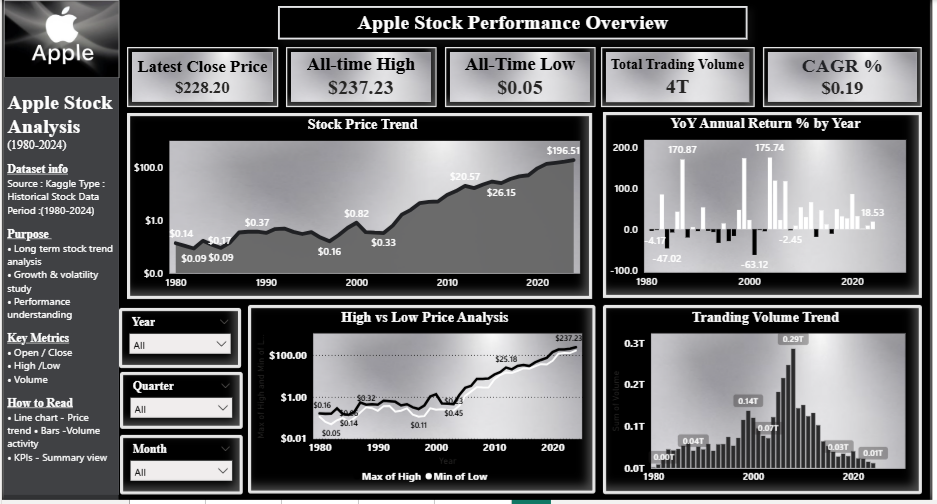
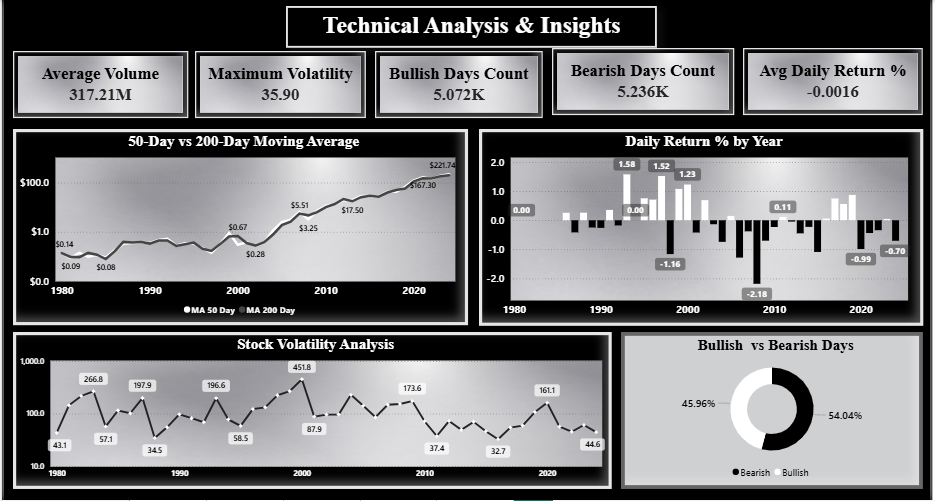
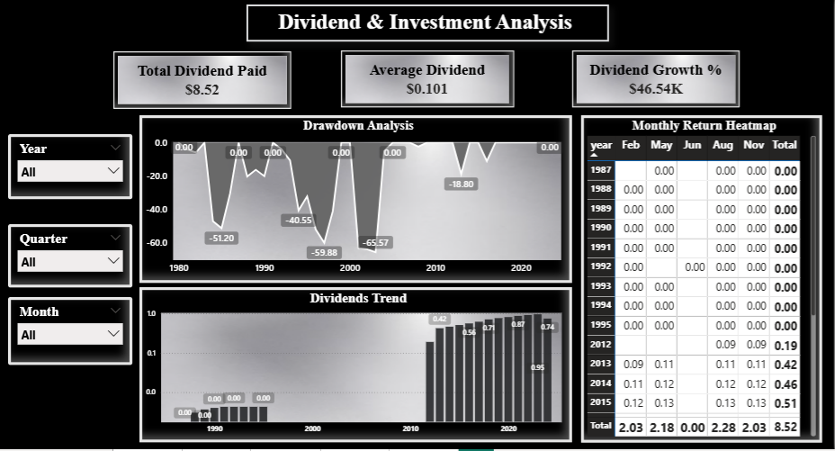
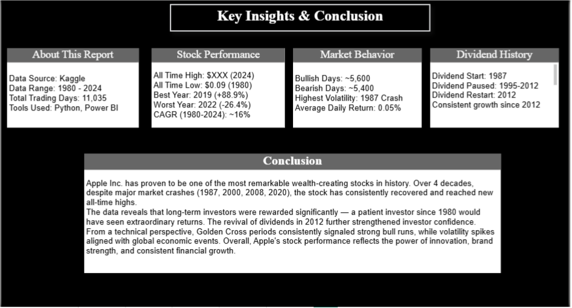

# 🍎 Apple Stock Analysis Dashboard (1980–2024)

An interactive Power BI dashboard analyzing 44 years of Apple Inc. stock data — covering price trends, volatility, technical indicators, and dividend history.

---

## 📊 Dashboard Overview

| Page | Title | Description |
|------|-------|-------------|
| 1 | Apple Stock Performance Overview | Price trends, volume, YoY returns, CAGR |
| 2 | Technical Analysis & Insights | Moving averages, volatility, bullish/bearish analysis |
| 3 | Dividend & Investment Analysis | Dividend history, drawdown, heatmap |
| 4 | Key Insights & Conclusion | Summary findings and business insights |

---

## 📁 Dataset

- **Source:** Kaggle
- **Files Used:**
  - `AppleStockPrice.csv` — Daily OHLCV data (1980–2024)
  - `AppleStockDividend.csv` — Quarterly dividend payments (1987–2024)
- **Total Trading Days:** 11,035
- **Period:** December 1980 — September 2024

---

## 🛠️ Tools & Technologies

| Tool | Usage |
|------|-------|
| Power BI Desktop | Dashboard, Data Modeling, DAX |
| Power Query | Data Cleaning, Date Formatting |
| DAX | KPI Measures, Calculated Columns |

---

## 📐 DAX Measures Created

### Page 1 — Stock Overview

.

- `Latest Close Price` — Most recent closing price
- `All Time High` — Maximum price since 1980
- `All Time Low` — Minimum price since 1980
- `Total Trading Volume` — Sum of all traded shares
- `CAGR %` — Compound Annual Growth Rate (1980–2024)
- `YoY Annual Return %` — Year-over-Year return percentage

### Page 2 — Technical Analysis

.

- `Avg Daily Return %` — Average daily price change
- `Maximum Volatility` — Highest single-day High-Low range %
- `Bullish Days Count` — Days where Close > Open
- `Bearish Days Count` — Days where Close < Open
- `Average Volume` — Mean daily trading volume
- `Daily Return %` — Daily price return
- `MA 50 Day` — 50-Day Moving Average
- `MA 200 Day` — 200-Day Moving Average
- `Volatility` — Daily High-Low volatility %

### Page 3 — Dividend Analysis

.

- `Total Dividend Paid` — Sum of all dividends
- `Average Dividend` — Mean dividend per payment
- `Dividend Growth %` — Growth from first to latest dividend
- `Drawdown %` — Price decline from peak at each point

---

## 📈 Key Insights

.

- **CAGR ~16%** — One of the highest long-term returns in stock market history
- **Best Year:** 2019 (+88.9% return)
- **Worst Year:** 2022 (-26.4% return)
- **Dividend Gap (1995–2012):** Steve Jobs paused dividends to fund company growth; Tim Cook restarted in 2012
- **Volatility Spikes:** 1987 crash, 2000 dot-com bubble, 2008 financial crisis, 2020 COVID — all visible in data
- **Golden Cross (2019):** 50-day MA crossed above 200-day MA — strong bull run followed

---

## 🗂️ Data Modeling

- `AppleStockPrice` ↔ `AppleStockDividend` — Linked via **Date** column (One-to-One)
- Slicers: Year, Month, Quarter — filter all visuals across pages interactively

---

## 📊 Power BI File

📥 [Download Dashboard (.pbix)](Apple_Stock_Analysis.pbix)

## 🚀 How to Open

1. Download `Apple_Stock_Analysis.pbix`
2. Open in **Power BI Desktop**
3. All data is embedded — no external connection needed

---

## 👩‍💻 Author

**Ishika Verma**  
Data Analyst | Power BI | SQL | Python  
[LinkedIn Profile](#) <!-- https://www.linkedin.com/in/ishika-verma-4b60bb3aa -->

