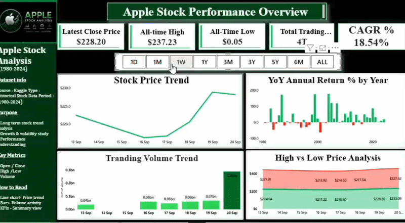
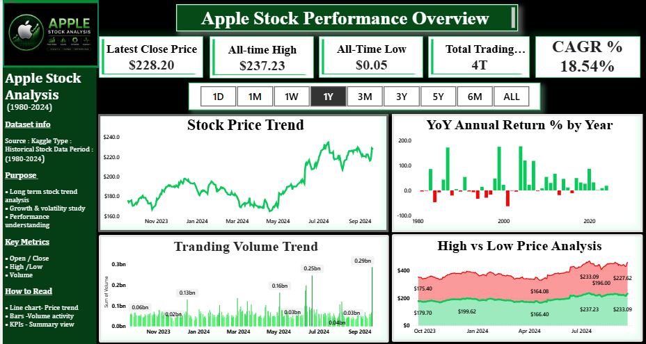
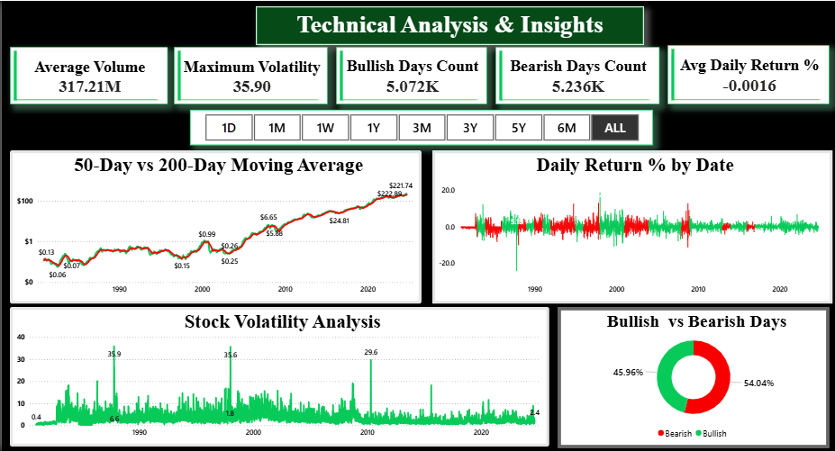
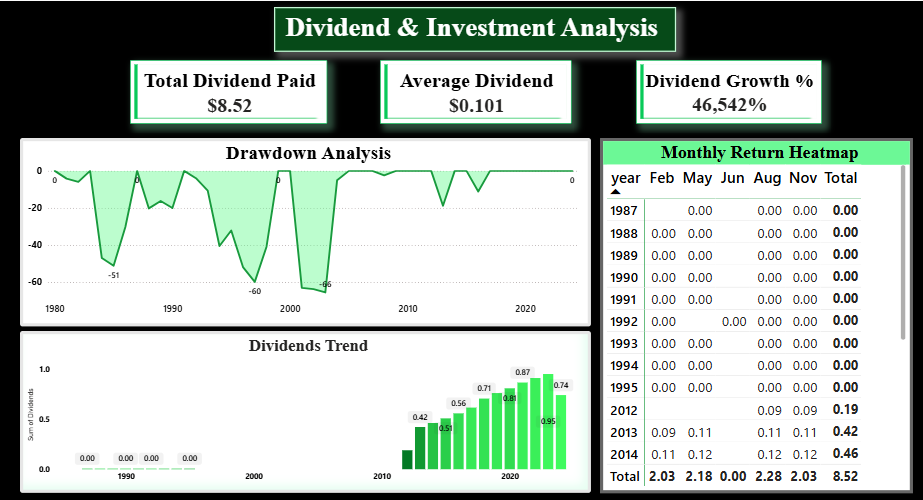
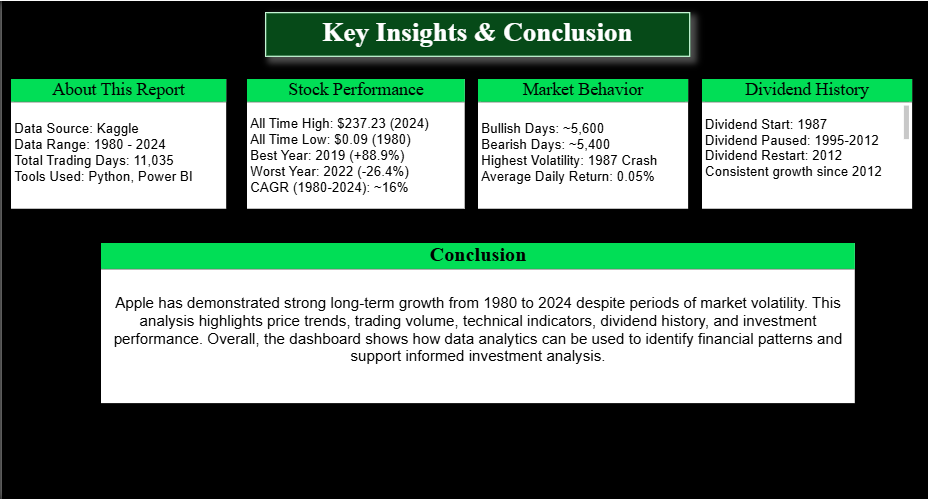

# 🍎 Apple Stock Analysis Dashboard (1980–2024)

An interactive Power BI dashboard…

An interactive Power BI dashboard built to analyze **44 years of Apple Inc. stock market data (1980–2024)**. This project combines financial analysis, technical indicators, and investment insights with dynamic DAX-driven interactivity.

---

## 📊 Dashboard Overview

| Page | Title | Description |
|------|-------|-------------|
| 1 | Apple Stock Performance Overview | Price trends, trading volume, CAGR, YoY returns and interactive time-period analysis |
| 2 | Technical Analysis & Insights | 50-Day & 200-Day Moving Averages, volatility, bullish/bearish analysis |
| 3 | Dividend & Investment Analysis | Dividend history, drawdown analysis, monthly return heatmap |
| 4 | Key Insights & Conclusion | Business insights and summary of long-term stock performance |

---

## ✨ Project Highlights

- 📈 Analysis of **44 years (1980–2024)** of Apple stock market data
- ⚡ Interactive **4-page Power BI dashboard**
- 🎯 Custom **DAX-based Time Period Slicer (1D, 1W, 1M, 3M, 6M, 1Y, 3Y, 5Y & ALL)** inspired by stock market applications
- 🐍 Python used for data cleaning and preprocessing
- 📊 Technical analysis using Moving Averages and Volatility
- 💰 Dividend and long-term investment analysis

---

## 📁 Dataset

**Source:** Kaggle

**Files Used**

- AppleStockPrice.csv
- AppleStockDividend.csv
- AAPL_historical_data.csv

**Period:** December 1980 – September 2024

**Total Trading Days:** 11,035

---

## 🛠️ Tools & Technologies

| Tool | Purpose |
|------|---------|
| Python | Data Cleaning & Data Preparation |
| Power BI Desktop | Dashboard Development |
| Power Query | Data Transformation |
| DAX | KPIs, Dynamic Measures & Time Period Slicer |

---

# 📄 Dashboard Pages

## 📌 Page 1 – Apple Stock Performance Overview

### KPIs

- Latest Close Price
- All-Time High
- All-Time Low
- Total Trading Volume
- CAGR %

### Visuals

- Stock Price Trend
- Trading Volume Trend
- High vs Low Price Analysis
- YoY Annual Return %

---

## 📌 Page 2 – Technical Analysis

### KPIs

- Average Daily Return %
- Maximum Volatility
- Bullish Days Count
- Bearish Days Count
- Average Volume

### Visuals

- 50-Day vs 200-Day Moving Average
- Daily Return %
- Bullish vs Bearish Distribution
- Stock Volatility Analysis

---

## 📌 Page 3 – Dividend & Investment Analysis

### KPIs

- Total Dividend Paid
- Average Dividend
- Dividend Growth %

### Visuals

- Dividend History
- Monthly Return Heatmap
- Drawdown Analysis

---

## 📌 Page 4 – Key Insights & Conclusion

### Key Insights

- CAGR of approximately **16%** over four decades
- Strong long-term capital appreciation
- Dividend payments resumed after 2012 with consistent growth
- Major market events reflected through volatility analysis
- Golden Cross periods were often followed by strong upward price trends

---

# 📐 DAX Features

- Latest Close Price
- CAGR %
- YoY Annual Return %
- Daily Return %
- Maximum Volatility
- Drawdown %
- Dividend Growth %
- Bullish/Bearish Days
- 50-Day Moving Average
- 200-Day Moving Average
- **Dynamic Time Period Slicer (1D–ALL)**

---

## 🗂️ Data Model

- AppleStockPrice ↔ AppleStockDividend (Date Relationship)
- Interactive filtering using Year, Month, Quarter and Custom DAX Time Period Slicer

## 📊 Power BI File

📥 [Download Dashboard (.pbix)](Apple_Stock_Analysis.pbix.pbix)

## 🚀 How to Open

1. Download `Apple_Stock_Analysis.pbix`
2. Open in **Power BI Desktop**
3. All data is embedded — no external connection needed

---
## 👩‍💻 Author

**Ishika Verma**

Aspiring Data Analyst

**Skills:** Power BI • Python • SQL • DAX • Power Query • Excel

[LinkedIn Profile](#) <!-- https://www.linkedin.com/in/ishika-verma-4b60bb3aa -->

